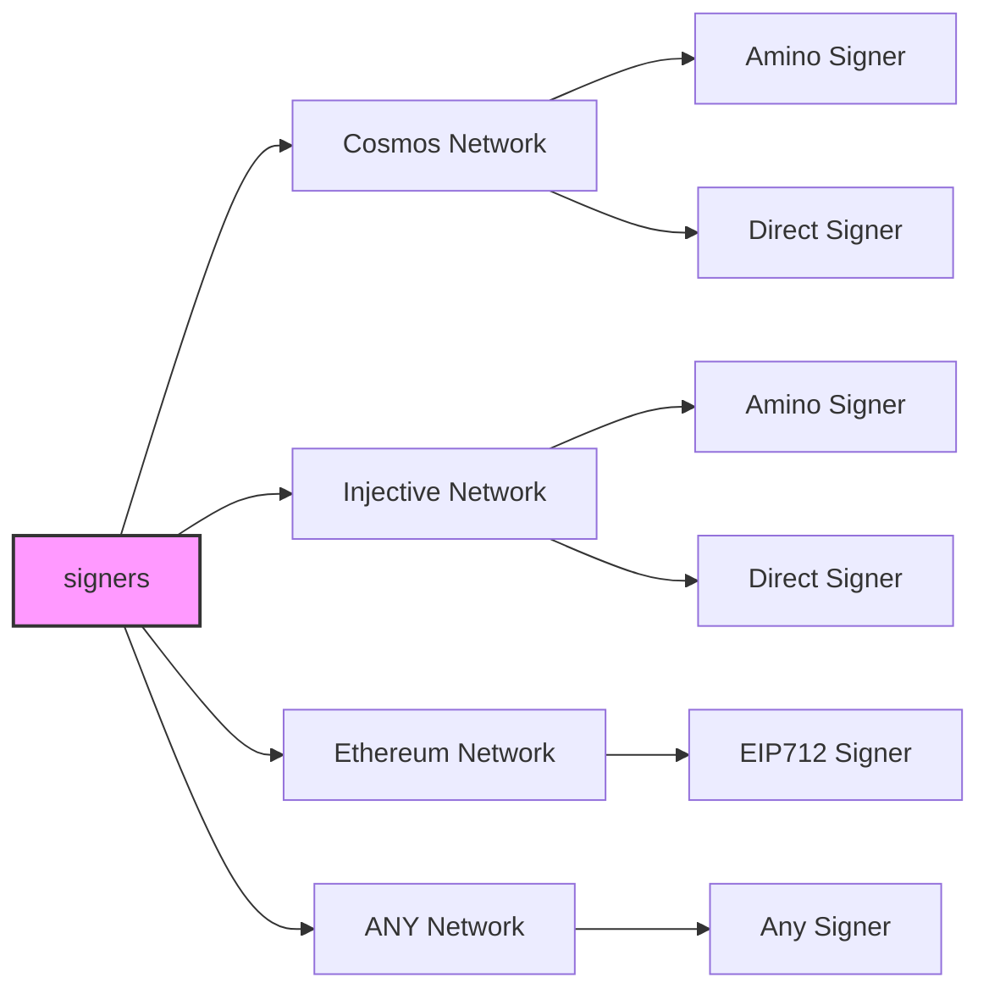
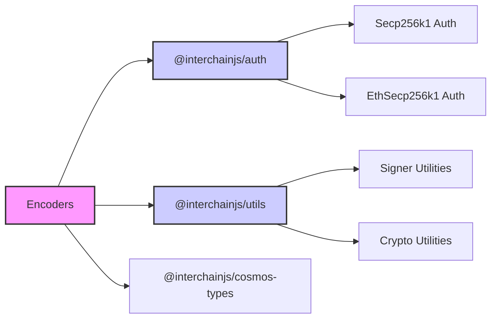

# InterchainJS

  

  
   
   

A single, universal signing interface for any network. Birthed from the interchain ecosystem for builders. Create adapters for any Web3 network.

## Table of Contents

- [Introduction](#interchainjs-universal-signing-for-web3)
- [Overview](#overview)
- [Tutorials and Docs](#tutorial-for-building-a-custom-signer)
- [Auth](#auth)
- [Supported Networks](#supported-networks)
  - [Cosmos Network](#cosmos-network)
  - [Injective Network](#injective-network)
  - [Ethereum Network](#ethereum-network)
- [Interchain JavaScript Stack ⚛️](#interchain-javascript-stack-⚛️)
- [Credits](#credits)
- [Disclaimer](#disclaimer)

## InterchainJS: Universal Signing for Web3

[InterchainJS](https://hyperweb.io/stack/interchainjs) is a **universal signing interface** designed for seamless interoperability across blockchain networks. It is one of the **core libraries of the [Interchain JavaScript Stack](https://hyperweb.io/stack)**, a modular framework that brings Web3 development to millions of JavaScript developers.

At its core, InterchainJS provides a **flexible adapter pattern** that abstracts away blockchain signing complexities, making it easy to integrate new networks, manage accounts, and support diverse authentication protocols and signing algorithms—all in a unified, extensible framework.

## Overview

InterchainJS sits at the foundation of the **[Interchain JavaScript Stack](https://hyperweb.io/stack)**, a set of tools that work together like nested building blocks:

- **[InterchainJS](https://hyperweb.io/stack/interchainjs)** → Powers signing across Cosmos, Ethereum (EIP-712), and beyond.
- **[Interchain Kit](https://hyperweb.io/stack/interchain-kit)** → Wallet adapters that connect dApps to multiple blockchain networks.
- **[Interchain UI](https://hyperweb.io/stack/interchain-ui)** → A flexible UI component library for seamless app design.
- **[Create Interchain App](https://hyperweb.io/stack/create-interchain-app)** → A developer-friendly starter kit for cross-chain applications.

This modular architecture ensures **compatibility, extensibility, and ease of use**, allowing developers to compose powerful blockchain applications without deep protocol-specific knowledge.

### Visualizing InterchainJS Components

The diagram below illustrates how InterchainJS connects different signer types to various network classes, showcasing its adaptability for a wide range of blockchain environments.

---

## Tutorials & Documentation

| Topic                            | Documentation |
|----------------------------------|--------------|
| **Building a Custom Signer**     | [Tutorial](/docs/tutorial.md) |
| **Advanced Documentation**       | [View Docs](/docs/) |

---

## Auth

The authentication module is universally applied across different networks.

| Package | Description |
|---------|-------------|
| [@interchainjs/auth](/packages/auth/README.md) | Handles authentication across blockchain networks. |
| [Advanced Docs: `Auth vs. Wallet vs. Signer`](/docs/auth-wallet-signer.md) | Explanation of the differences between authentication, wallets, and signers. |

---

## Supported Networks

### Cosmos Network

| Feature | Package |
|---------|---------|
| **Transactions** | [@interchainjs/cosmos](/networks/cosmos/README.md) |
| **Cosmos Types** | [@interchainjs/cosmos-types](/networks/cosmos-msgs/README.md) |
| **Migration from `@cosmjs`** | [interchainjs](/networks/cosmjs/README.md) |

---

### Injective Network

| Feature | Package |
|---------|---------|
| **Transactions** | [@interchainjs/injective](/networks/injective/README.md) |

---

### Ethereum Network

| Feature | Package |
|---------|---------|
| **Transactions** | [@interchainjs/ethereum](/networks/ethereum/README.md) |

---

## Interchain JavaScript Stack ⚛️

A unified toolkit for building applications and smart contracts in the Interchain ecosystem

| Category              | Tools                                                                                                                  | Description                                                                                           |
|----------------------|------------------------------------------------------------------------------------------------------------------------|-------------------------------------------------------------------------------------------------------|
| **Chain Information**   | [**Chain Registry**](https://github.com/hyperweb-io/chain-registry), [**Utils**](https://www.npmjs.com/package/@chain-registry/utils), [**Client**](https://www.npmjs.com/package/@chain-registry/client) | Everything from token symbols, logos, and IBC denominations for all assets you want to support in your application. |
| **Wallet Connectors**| [**Interchain Kit**](https://github.com/hyperweb-io/interchain-kit)beta, [**Cosmos Kit**](https://github.com/hyperweb-io/cosmos-kit) | Experience the convenience of connecting with a variety of web3 wallets through a single, streamlined interface. |
| **Signing Clients**          | [**InterchainJS**](https://github.com/hyperweb-io/interchainjs)beta, [**CosmJS**](https://github.com/cosmos/cosmjs) | A single, universal signing interface for any network |
| **SDK Clients**              | [**Telescope**](https://github.com/hyperweb-io/telescope)                                                          | Your Frontend Companion for Building with TypeScript with Cosmos SDK Modules. |
| **Starter Kits**     | [**Create Interchain App**](https://github.com/hyperweb-io/create-interchain-app)beta, [**Create Cosmos App**](https://github.com/hyperweb-io/create-cosmos-app) | Set up a modern Interchain app by running one command. |
| **UI Kits**          | [**Interchain UI**](https://github.com/hyperweb-io/interchain-ui)                                                   | The Interchain Design System, empowering developers with a flexible, easy-to-use UI kit. |
| **Testing Frameworks**          | [**Starship**](https://github.com/hyperweb-io/starship)                                                             | Unified Testing and Development for the Interchain. |
| **TypeScript Smart Contracts** | [**Create Hyperweb App**](https://github.com/hyperweb-io/create-hyperweb-app)                              | Build and deploy full-stack blockchain applications with TypeScript |
| **CosmWasm Contracts** | [**CosmWasm TS Codegen**](https://github.com/CosmWasm/ts-codegen)                                                   | Convert your CosmWasm smart contracts into dev-friendly TypeScript classes. |

## Credits

🛠 Built by Hyperweb (formerly Cosmology) — if you like our tools, please checkout and contribute to [our github ⚛️](https://github.com/hyperweb-io)

## Disclaimer

AS DESCRIBED IN THE LICENSES, THE SOFTWARE IS PROVIDED “AS IS”, AT YOUR OWN RISK, AND WITHOUT WARRANTIES OF ANY KIND.

No developer or entity involved in creating this software will be liable for any claims or damages whatsoever associated with your use, inability to use, or your interaction with other users of the code, including any direct, indirect, incidental, special, exemplary, punitive or consequential damages, or loss of profits, cryptocurrencies, tokens, or anything else of value.
