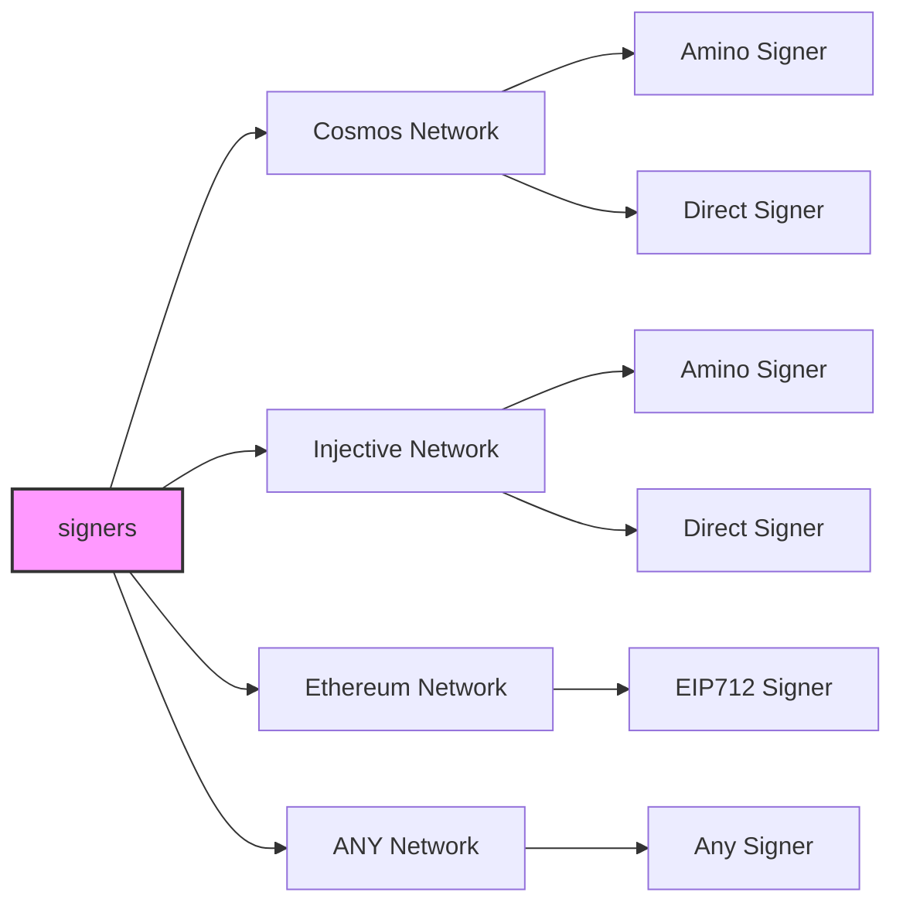
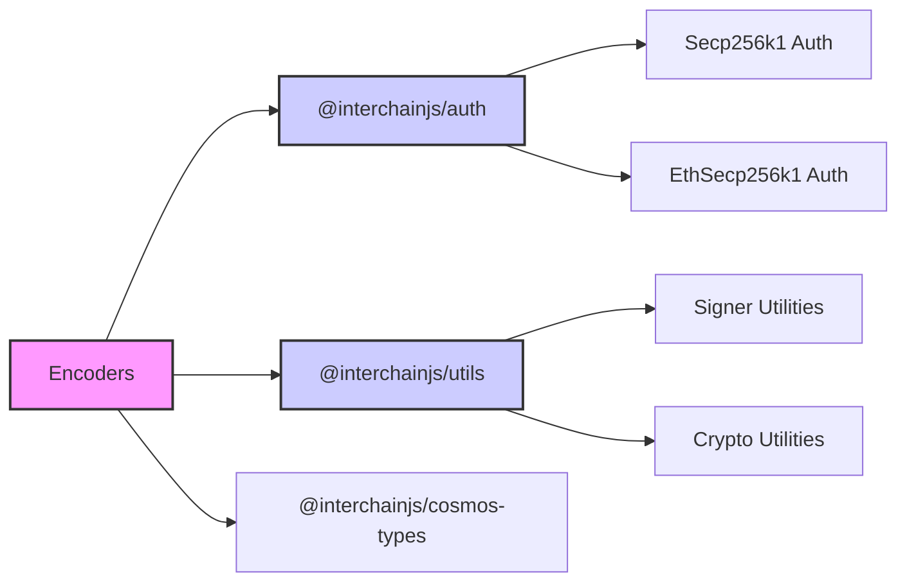

# interchainjs

  

  <!--  -->
   
   

A single, universal signing interface for any network. Birthed from the interchain ecosystem for builders. Create adapters for any web3 network.

⚠️ **This software is currently in a Development Preview Alpha stage.** It is not ready for production use. The features and functionality are subject to change, and there may be significant issues. We welcome feedback and contributions, but please use with caution and at your own risk.

- [Advanced Docs](/docs/)

## Overview

InterchainJS is a versatile signing library designed to cater to a variety of blockchain networks through a flexible adapter pattern. This architecture enables seamless integration of new networks, account management modules, authentication protocols, and signing algorithms.

By employing this pattern, InterchainJS ensures compatibility and extensibility, allowing developers to easily plug in and configure components tailored to specific requirements. The graphic below illustrates how different signer types are connected to specific network classes, demonstrating the library's adaptability in handling diverse blockchain environments.

## Tutorial for building a custom signer

- [Tutorial](/docs/tutorial.md)

## Auth

Universally applied across different networks

- [@interchainjs/auth](/packages/auth/README.md)
- [Advanced Docs: `Auth vs. Wallet vs. Signer`](/docs/auth-wallet-signer.md)

## Cosmos Network

### Transactions

- [@interchainjs/cosmos](/networks/cosmos/README.md)
- [@interchainjs/cosmos-types](/networks/cosmos-msgs/README.md)

### Migration from `@cosmjs`

We created a specific package to make it easy to migrate from `@cosmjs`.

- [interchainjs](/networks/cosmjs/README.md)

## Injective Network

### Transactions

- [@interchainjs/injective](/networks/injective/README.md)
- `@interchainjs/injective-msgs`(on progress)

## Ethereum Network

### Transactions

- [@interchainjs/ethereum](/networks/ethereum/README.md)
