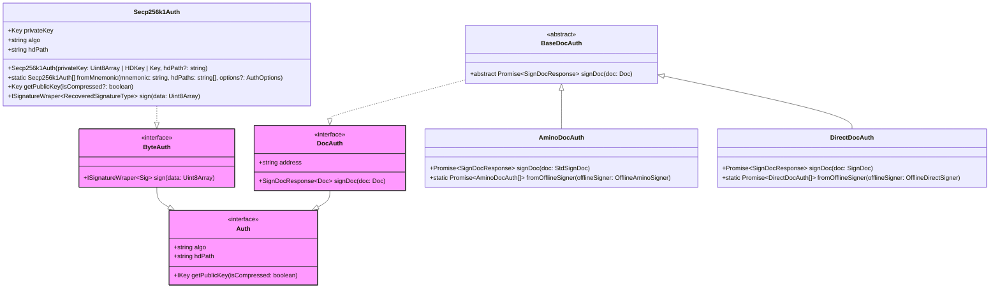

# Auth

The main purpose of the `@interchainjs/auth` is to offer developers a way to have different wallet algorithm implementations on Blockchain, including `secp256k1`, `ethSecp256k1`, etc. All of these algorithms implementations are exposing the same `Auth` interface which means that `Signer`s can just use these methods without the need to know the underlying implementation for specific algorithms as they are abstracted away.



To start, you have to make an instance of the `*Auth` (i.e. `Secp256k1Auth`) class which gives you the ability to use different algorithms out of the box.

Usually it can be instantiated from constructor or static methods.

- `fromMnemonic` makes an instance from a mnemonic words string. This instance can both `sign`.

Let's have a look at the properties and methods that `Auth` interface exposes and what they mean:

- `algo` implies the algorithm name, i.e. `secp256k1`, `ed25519`.
- `getPublicKey` gets the public key. This method returns the compressed or uncompressed public key according to the value of argument `isCompressed`.
- `sign` signs binary data that can be any piece of information or message that needs to be digitally signed, and returns a `Signature` typed object. Note: this method itself usually does not inherently involve any hash method.

It's important to note that for a specific cryptographic algorithms, the corresponding `*Auth` class implements `Auth` interface in a way that can be universally applied on different networks. That's why `sign` method usually don't apply any hash function to the targeted message data. Those various hashing processes will be configured in different `Signer`s. That is:

- `*Auth` classes differs across algorithms but independent of networks
- `*Signer` classes differs across networks but independent of algorithms

See [usage example](/docs/signer.md#signer--auth).

## ByteAuth vs. DocAuth

### ByteAuth

`ByteAuth` is an interface that extends the `Auth` interface and represents an authentication method that can sign arbitrary bytes. It is typically used for signing arbitrary data using specific algorithms like `secp256k1` or `eth_secp256k1`. The `sign` method in `ByteAuth` takes a `Uint8Array` of data and returns a signature wrapped in an `ISignatureWraper`.

### DocAuth

`DocAuth` is an interface that extends the `Auth` interface and represents an authentication method that can sign documents using offline signers. It is a wrapper for offline signers and is usually used by signers built from offline signers. The `signDoc` method in `DocAuth` takes a document of a specific type and returns a `SignDocResponse`. The `DocAuth` interface also includes an `address` property that represents the address associated with the authentication method.

## Auth vs. Wallet

Both `Auth` and `Wallet` are interfaces that contains `sign` method.

```ts
/** you can import { Auth, Wallet } from "@interchainjs/types" */

export interface Auth {
  ...,
  sign: (data: Uint8Array) => Signature;
}

export interface Wallet<Account, SignDoc> {
  ...,
  async signDirect(
    signerAddress: string,
    signDoc: CosmosDirectDoc
  ): Promise<DirectSignResponse>;
  async signAmino(
    signerAddress: string,
    signDoc: CosmosAminoDoc
  ): Promise<AminoSignResponse>;
}
```

As we can see above, the signing target of `Wallet` is can be any type (usually we set it as the sign document type) while in `Auth` it's limited to binary data.

For each `Signer` it always has a specific type of sign document type as the signing target to get signature (i.e. for `AminoSigner` it's `StdSignDoc` and for `DirectSigner` it's `SignDoc`). And for some Web3 wallet, they only expose signing methods of the sign document rather than the generalized binary data. Under this circumstance, users are still abled to construct a `Signer` object via the `fromWallet` static method. This is why `Wallet` interface is created.

See [usage example](/docs/signer.md#signer--wallet).
