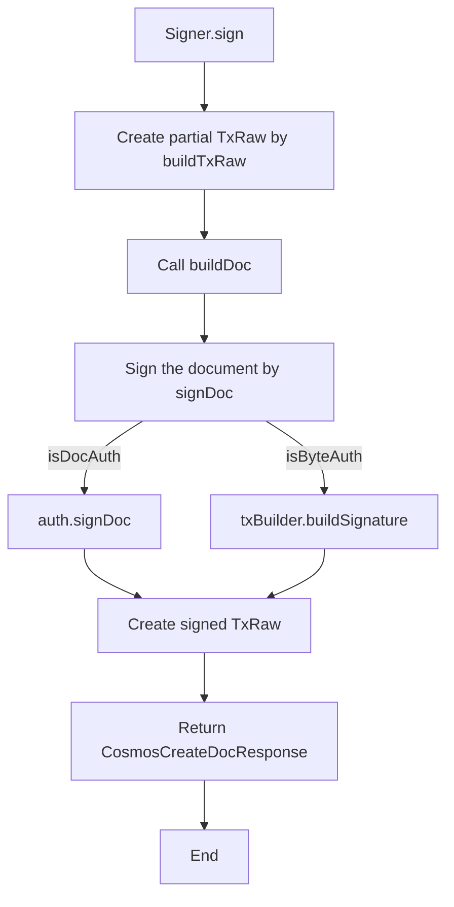

# Signer

The main purpose of the `@interchainjs/cosmos`, `@interchainjs/ethereum`, `@interchainjs/ethermint` is to offer developers a way to have different `Signer` implementations on different types of Blockchains. All of these `Signer`s are implementing [`UniSigner` interface](#unisigner-interface) and extending the same `BaseSigner` class which with `Auth` object being utilized in construction.

Class diagram:

```mermaid
classDiagram
    class UniSigner {
        <<interface>>
        IKey publicKey
        AddressResponse getAddress()
        IKey | Promise~IKey~ signArbitrary(Uint8Array data)
        SignDocResponse~Doc~ | Promise~SignDocResponse~Doc~~ signDoc(Doc doc)
        Promise~BroadcastResponse~ broadcastArbitrary(Uint8Array data, BroadcastOptions options)
        Promise~SignResponse~Tx, Doc, BroadcastResponse~~ sign(SignArgs args)
        Promise~BroadcastResponse~ signAndBroadcast(SignArgs args, BroadcastOptions options)
        Promise~BroadcastResponse~ broadcast(Tx tx, BroadcastOptions options)
    }

    class BaseSigner {
        <<abstract>>
        +Auth auth
        +SignerConfig config
    }

    class CosmosDocSigner {
        +ISigBuilder txBuilder
        +CosmosDocSigner(Auth auth, SignerConfig config)
        +abstract ISigBuilder getTxBuilder()
        +Promise~SignDocResponse~ signDoc(SignDoc doc)
    }

    class CosmosBaseSigner {
        +Encoder[] encoders
        +string prefix
        +IAccount account
        +BaseCosmosTxBuilder txBuilder
        +CosmosBaseSigner(Auth auth, Encoder[] encoders, string|HttpEndpoint endpoint, SignerOptions options)
        +abstract Promise~IAccount~ getAccount()
        +abstract BaseCosmosTxBuilder getTxBuilder()
        +Promise~string~ getPrefix()
        +Promise~string~ getAddress()
        +void setEndpoint(string|HttpEndpoint endpoint)
        +QueryClient get queryClient()
        +Promise~SignResponse~ sign(CosmosSignArgs args)
        +Promise~BroadcastResponse~ broadcast(TxRaw txRaw, BroadcastOptions options)
        +Promise~BroadcastResponse~ broadcastArbitrary(Uint8Array message, BroadcastOptions options)
        +Promise~BroadcastResponse~ signAndBroadcast(CosmosSignArgs args, BroadcastOptions options)
        +Promise~SimulateResponse~ simulate(CosmosSignArgs args)
    }

    class DirectSigner {
        +auth: Auth
        +encoders: Encoder[]
        +endpoint: string | HttpEndpoint
        +options: SignerOptions
        +static fromWallet(signer: OfflineDirectSigner, encoders: Encoder[], endpoint?: string | HttpEndpoint, options?: SignerOptions): Promise~DirectSigner~
        +static fromWalletToSigners(signer: OfflineDirectSigner, encoders: Encoder[], endpoint?: string | HttpEndpoint, options?: SignerOptions): Promise~DirectSigner[]~
    }

    class AminoSigner {
        +auth: Auth
        +encoders: Encoder[]
        +endpoint: string | HttpEndpoint
        +options: SignerOptions
        +static fromWallet(signer: OfflineDirectSigner, encoders: Encoder[], endpoint?: string | HttpEndpoint, options?: SignerOptions): Promise~DirectSigner~
        +static fromWalletToSigners(signer: OfflineDirectSigner, encoders: Encoder[], endpoint?: string | HttpEndpoint, options?: SignerOptions): Promise~DirectSigner[]~
    }

    class ISigBuilder {
        <<interface>>
        +buildSignature(doc: Doc): Sig | Promise<Sig>
    }

    class ITxBuilder {
        <<interface>>
        +buildSignedTxDoc(args: SignArgs): Promise<SignResp>
    }

    class BaseCosmosTxBuilder {
        +SignMode signMode
        +BaseCosmosTxBuilderContext ctx
        +buildDoc(args: CosmosSignArgs, txRaw: Partial~TxRaw~): Promise~SignDoc~
        +buildDocBytes(doc: SignDoc): Promise~Uint8Array~
        +buildTxRaw(args: CosmosSignArgs): Promise~Partial~TxRaw~
        +buildTxBody(args: CosmosSignArgs): Promise~TxBody~
        +buildSignerInfo(publicKey: EncodedMessage, sequence: bigint, signMode: SignMode): Promise~SignerInfo~
        +buildAuthInfo(signerInfos: SignerInfo[], fee: Fee): Promise~AuthInfo~
        +getFee(fee: StdFee, txBody: TxBody, signerInfos: SignerInfo[], options: DocOptions): Promise~StdFee~
        +buildSignedTxDoc(args: CosmosSignArgs): Promise~CosmosCreateDocResponse~SignDoc~~
    }

    BaseSigner <|-- CosmosDocSigner
    CosmosDocSigner <|-- CosmosBaseSigner
    CosmosBaseSigner <|-- DirectSigner
    CosmosBaseSigner <|-- AminoSigner
    UniSigner <|.. CosmosBaseSigner

    BaseCosmosTxBuilder --|> ITxBuilder

    CosmosDocSigner *-- ISigBuilder
    CosmosBaseSigner *-- ITxBuilder

    style UniSigner fill:#f9f,stroke:#333,stroke-width:2px
    style ISigBuilder fill:#f9f,stroke:#333,stroke-width:2px
    style ITxBuilder fill:#f9f,stroke:#333,stroke-width:2px
```



Workflow:



```ts
import { UniSigner } from "@interchainjs/types";
import { BaseSigner } from "@interchainjs/types";
```

Need to note that there are 2 type parameters that indicates 2 types of document involved in signing and broadcasting process for interface `UniSigner`:

- `SignDoc` is the document type as the signing target to get signature
- `Tx` is the signed transaction type to broadcast

The `Signer` class is a way to sign and broadcast transactions on blockchains with ease. With it, you can just pass a Message that you want to be packed in a transaction and the transaction will be prepared, signed and broadcasted.

## Signer + Auth

As we know, `Auth` object can be used to sign any piece of binary data (See [details](/docs/auth.md)). However, combining with the `*Signer` class allows you to sign human-readable messages or transactions using one function call.

### Usage

```ts
import { DirectSigner } from "@interchainjs/cosmos/signers/direct";
import { toEncoder } from "@interchainjs/cosmos/utils";
import { Secp256k1Auth } from "@interchainjs/auth/secp256k1";
import { MsgSend } from "@interchainjs/cosmos-types/cosmos/bank/v1beta1/tx";

const [auth] = Secp256k1Auth.fromMnemonic("<MNEMONIC_WORDS>", [
      HDPath.cosmos().toString(),
    ]);
const signer = new DirectSigner(auth, [toEncoder(MsgSend)], <RPC_ENDPOINT>);
```

## Signer + Wallet

`Wallet` object can also be used to sign documents (See [details](/docs/auth.md#auth-vs-wallet)). However, some sign document is still not human-readable (i.e. for `DirectSigner`, the `SignDoc` type is an object with binary data types)

However, combining with the `Signer` class allows you to sign human-readable messages or transactions using one function call.

### Usage

```ts
import { DirectSigner } from "@interchainjs/cosmos/signers/direct";
import { DirectWallet, SignDoc } from "@interchainjs/cosmos/types";
import { toEncoder } from "@interchainjs/cosmos/utils";
import { MsgSend } from "@interchainjs/cosmos-types/cosmos/bank/v1beta1/tx";

const directWallet = Secp256k1HDWallet.fromMnemonic("<MNEMONIC_WORDS>", [
  {
    prefix: commonPrefix,
    hdPath: cosmosHdPath,
  },
]);
const signer = await DirectSigner.fromWallet(wallet, [toEncoder(MsgSend)], <RPC_ENDPOINT>);
```

> Tips: `interchainjs` also provides helper methods to easily construct `Wallet` for each `Signer`. See [details](/docs/wallet.md#easy-to-construct-wallet).

## UniSigner Interface

There are 3 main signing methods in `UniSigner`

```ts
/** you can import { UniSigner } from "@interchainjs/types" */
export interface UniSigner<SignDoc, Tx> {
  ...
  signArbitrary(data: Uint8Array): IKey;
  signDoc: (doc: SignDoc) => Promise<SignDocResponse<SignDoc>>;
  sign(
    messages: unknown,
    ...args: unknown[]
  ): Promise<SignResponse<SignDoc, Tx>>;
  ...
}
```

- `signArbitrary`, derived from `Auth` object, is usually used to request signatures that don't need to be efficiently processed on-chain. It's often used for signature challenges that are authenticated on a web server, such as sign-in with Ethereum/Cosmos.
- `signDoc`, derived from `Wallet` object, is usually used to request signatures that are efficient to process on-chain. The `doc` argument varies among different signing modes and networks.
- `sign` is used to sign human-readable message, to facilidate signing process with an user interface.

> Tips: These 3 signing methods correspond to 3 levels of signing type: [Auth vs. Wallet vs. Signer](/docs/auth-wallet-signer.md).

## Types

> Tips about the headers:
>
> - **Class**: the Class implements the Interface
> - **SignDoc**: document structure for signing
> - **Transaction**: document structure for broadcasting (abbr. `Tx`)
> - **Wallet**: interface for web3 wallets
> - **WalletAccount**: interface for web3 wallets account

### CosmosDirectSigner

- **Class**: `import { DirectSigner } from "@interchainjs/cosmos/signers/direct"`
- **SignDoc**: CosmosDirectDoc
- **Transaction**: CosmosTx
- **Wallet**: Secp256k1HDWallet
- **WalletAccount**: CosmosAccount

### CosmosAminoSigner

- **Class**: `import { AminoSigner } from "@interchainjs/cosmos/signers/amino"`
- **SignDoc**: CosmosAminoDoc
- **Transaction**: CosmosTx
- **Wallet**: Secp256k1HDWallet
- **WalletAccount**: CosmosAccount

### InjectiveDirectSigner

- **Class**: `import { DirectSigner } from "@interchainjs/ethermint/direct"`
- **SignDoc**: CosmosDirectDoc
- **Transaction**: CosmosTx
- **Wallet**:
- **WalletAccount**: InjectiveAccount

### InjectiveAminoSigner

- **Class**: `import { AminoSigner } from "@interchainjs/ethermint/amino"`
- **SignDoc**: CosmosAminoDoc
- **Transaction**: CosmosTx
- **Wallet**:
- **WalletAccount**: InjectiveAccount
