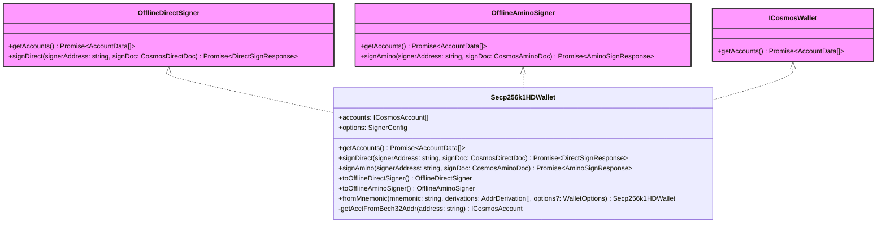

# Wallet

- See [Auth vs. Wallet vs. Signer](/docs/auth-wallet-signer.md)
- See more [Auth vs. Wallet](/docs/auth.md#auth-vs-wallet)



## Easy to Construct Wallet

Wallet can be constructed using fromMnemonic.

```ts
import { Secp256k1HDWallet } from "@interchainjs/cosmos/wallets/secp256k1hd";
import { HDPath } from "@interchainjs/types";

// init wallet with two accounts using two hd paths
const wallet = Secp256k1HDWallet.fromMnemonic(
  "<MNEMONIC_WORDS>",
  [0, 1].map((i) => ({
    prefix: commonPrefix,
    hdPath: HDPath.cosmos(0, 0, i).toString(),
  }))
);
```

Moreover, to construct `OfflineSigner`(a type from `@cosmjs`) object from `Wallet` to hide private key.

```ts
protoSigner = wallet.toOfflineDirectSigner();
address = (await protoSigner.getAccounts())[0].address;
```
